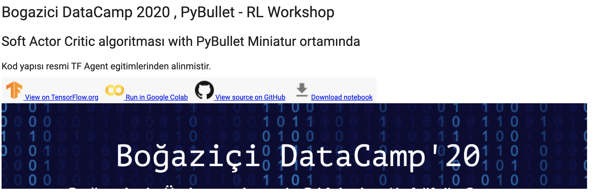

# DataCamp 2020 ReinforcementLearning Workshop
DataCamp 2020 Reinforcement Learning Workshop - Bogazici University, UGURKAN ATES
Content in Turkish & English.

In this example we are training a simple pyBullet RL agent with SAC using TF-Agents library on Google Colab.

